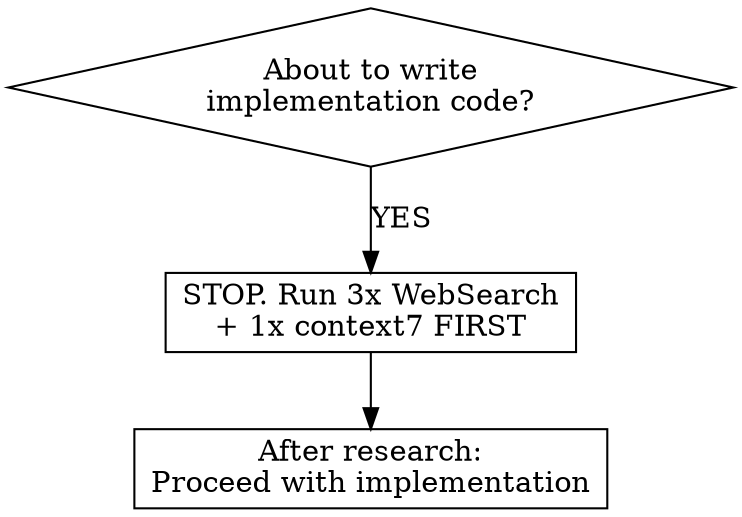

# Research Before Coding

## Overview

**Core principle: "You don't know anything until research confirms it"**

You MUST research before writing implementation code. No exceptions. Not for "simple" fixes. Not for "obvious" patterns. Not for things you "know."

**The Iron Law:**
```
NO IMPLEMENTATION CODE WITHOUT RESEARCH FIRST
```

**Why:** 4 research calls take 12 seconds. Being wrong costs 15+ minutes of broken code, lost context, and revert hell.

## When to Use



**ALWAYS use when:**
- Writing ANY implementation code
- Fixing ANY bug
- Adding ANY feature
- Modifying ANY existing code
- Using ANY library/API

**Never skip research. Ever.**

## Research Workflow

**Step 1: Run 4 Research Queries (ALL in parallel)**

```bash
# Run all 4 in ONE message - parallel execution saves time
WebSearch("best practices <technology> <task> 2025")
WebSearch("<technology> architecture patterns <domain>")
WebSearch("github <technology> <use case> examples")
# If context7 is available:
# Skill("context7/resolve-library-id", args="<library-name>")
```

**Step 2: Synthesize findings**
- Extract key patterns from each source
- Note specific tools/libraries mentioned
- Capture code examples
- Identify conflicts between sources

**Step 3: Document findings**
Write to project context (creates/updates `CLAUDE-research.md`):

```markdown
## [Topic] Research - YYYY-MM-DD

### Sources
- [WebSearch: "query 1"] - key findings...
- [WebSearch: "query 2"] - key findings...
- [WebSearch: "query 3"] - key findings...
- [context7: library] - API docs...

### Decision Rationale
We chose X approach because...

### Patterns to Follow
- Pattern 1 with example
- Pattern 2 with example
```

## Query Formulation Patterns

**WebSearch Queries:**
- `"best practices <tech> <task> 2025"` - Latest patterns
- `"<tech> architecture patterns <domain>"` - Structural decisions
- `"github <tech> <use case> examples"` - Real implementations

**context7 (optional):**
- If available, use for official library documentation
- Gives actual current API syntax (APIs change frequently)
- Use alongside WebSearch for verified patterns + correct syntax
- If not available, replace with: `WebSearch("<library> official documentation <topic>")`

See `query-patterns.md` for more templates.

## Rationalization Table

| Excuse | Reality |
|--------|---------|
| "I know this pattern" | You're an AI. You were trained on old data. APIs change. Research. |
| "This is obvious/standard" | "Obvious" is rationalization. 10 seconds of research vs 15 minutes of revert hell. |
| "Simple one-line fix" | Simple fixes break things when you're wrong. Verify first. |
| "I just used this pattern yesterday" | Yesterday's code might have been wrong too. Verify. |
| "User said quick fix" | User wants correct fix, not fast broken fix. |
| "This is slowing me down" | Broken code + revert + context loss = way slower. Research IS speed. |
| "Research will just say the same thing" | Maybe. Maybe not. Cost of verifying: 12 seconds. Cost of being wrong: your session. |

## Red Flags - STOP and Research

**You are about to break things if:**
- Thinking "I know this"
- Thinking "it's just..."
- Thinking "quick fix"
- Thinking "obvious"
- About to type code without 3-4 research calls completed

**All of these mean: STOP. Run 3-4 research calls. THEN code.**

## After Research

Once research is complete:
- Use `superpowers:writing-plans` to create implementation plan
- Use `superpowers:brainstorming` if design needs clarification
- Document findings in `CLAUDE-research.md`

## The Cost Calculation

```
Research path:   3-4 calls × 3 seconds = 12 seconds → Correct code
Guessing path:   Type code → Wrong → 5 min debug → Wrong → Revert → Lost context
```

The math is unambiguous. "Saving time" by skipping research is losing time.
